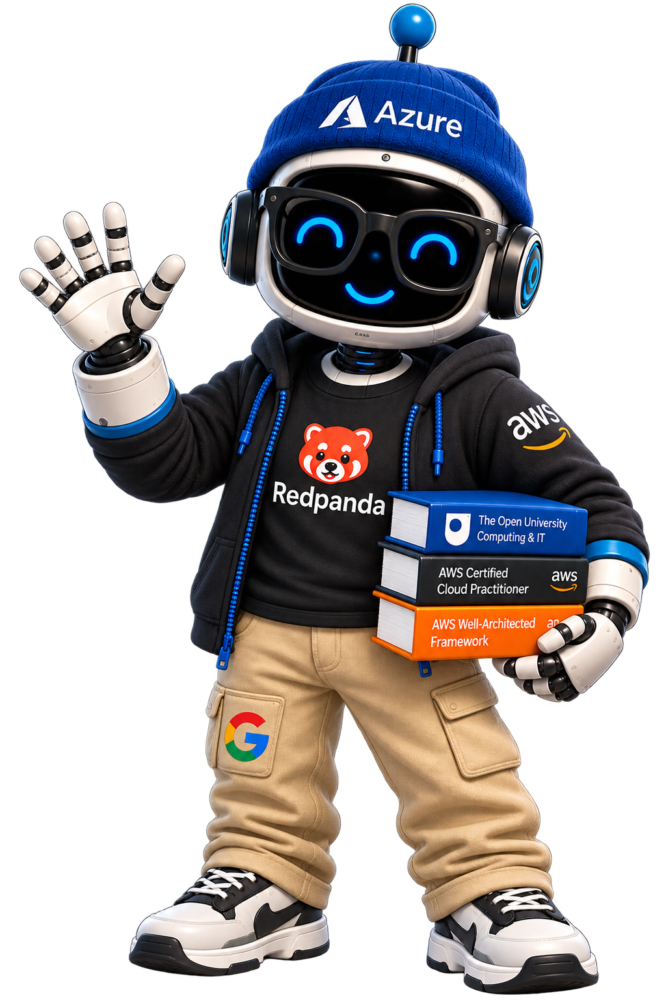
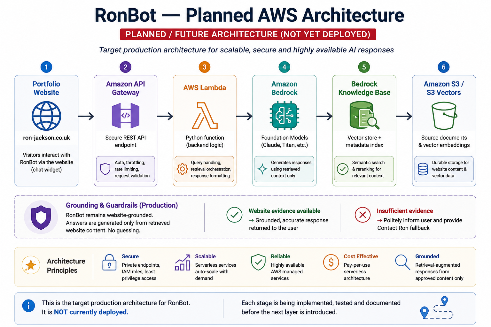

# 🤖 RonBot — Portfolio AI Assistant

**RonBot** is a website-grounded AI assistant designed to help visitors explore my professional experience, skills, education, certifications and technical projects through natural conversation.

<p align="center">
  
</p>

<p align="center">
  <a href="https://www.ron-jackson.co.uk">🌐 Portfolio</a> •
  <a href="docs/architecture.md">🏗️ Architecture</a> •
  <a href="docs/personality.md">💬 Personality</a> •
  <a href="docs/ronbot-character.md">🤖 Character Design</a>
</p>

---

## 📌 Project Snapshot

- ✅ Website-grounded knowledge ingestion
- ✅ Local retrieval and relevance scoring
- ✅ Grounded answers with safe fallback behaviour
- ✅ Recruiter and technical answer depth
- ✅ AWS Lambda serverless backend
- ✅ Amazon API Gateway HTTP API
- ✅ Browser-to-AWS RonBot integration
- ✅ CloudWatch logging and operational observability
- 🚧 Amazon Bedrock AI model integration next
- 🗺️ Managed AWS knowledge architecture planned

## ✨ Current Capabilities

**🔎 Retrieval:** Searches structured knowledge extracted from the portfolio website  
**💬 Grounded Answers:** Responds using retrieved website evidence rather than unrestricted knowledge  
**🧩 Multi-Chunk Evidence:** Combines relevant information when an answer spans multiple knowledge chunks  
**🛡️ Safe Fallback:** Unsupported questions are not guessed and direct visitors to the Contact page  
**🤖 Interaction:** Animated Robot Ron frontend with purposeful thinking states  
**♿ Accessibility:** Supports `prefers-reduced-motion`

## 🛡️ Grounding Principle

RonBot is deliberately restricted to approved portfolio content.

> **If it's on Ron's website, I can talk about it. If it isn't, I don't make it up.**

**Website evidence available** → Grounded answer  
**Insufficient evidence** → Contact Ron fallback

This boundary is a core design requirement, not simply a conversational preference.

## 🏗️ Current Architecture

RonBot currently uses a hybrid architecture combining website-grounded retrieval with a deployed AWS serverless API layer.

The browser sends questions to Amazon API Gateway, which invokes the RonBot AWS Lambda function. Lambda uses the existing Python retrieval and answer logic against the approved website knowledge base and returns the grounded response to the browser.

```text

Portfolio Website

       │

       ▼

RonBot Browser Interface

       │

       ▼

Amazon API Gateway

       │

       ▼

AWS Lambda

       │

       ├── Python Retrieval & Scoring

       │

       ├── Grounded Answer Logic

       │

       ▼

Website Knowledge Base

       │

       ▼

Grounded Response

       │

       ▼

RonBot Browser Interface

```

### ☁️ Planned AWS Architecture

> **HYBRID ARCHITECTURE — AWS API LAYER DEPLOYED; AI AND MANAGED KNOWLEDGE COMPONENTS PLANNED**

The AWS serverless API layer is now deployed and operational using Amazon API Gateway and AWS Lambda.

The next stage evolves the existing grounded architecture by introducing Amazon Bedrock for AI-generated responses while preserving RonBot's website-only knowledge boundary.

Future architecture work may also introduce managed AWS services for knowledge storage, retrieval, monitoring and security as RonBot progresses toward its production AI architecture.




**Frontend:** Portfolio Website → API Gateway  
**Compute:** API Gateway → AWS Lambda  
**AI:** Lambda → Amazon Bedrock  
**Knowledge:** Bedrock Knowledge Base → Amazon S3 / S3 Vectors  
**Guardrail:** Portfolio-grounded answers remain the core requirement

🔵 **Current status:** AWS API Gateway and Lambda deployed; Amazon Bedrock and managed knowledge components remain planned.

[View the detailed architecture decision →](docs/architecture.md)

## 🛠️ Technology Stack

### Current

- **Python** — retrieval, scoring, grounded answer logic and Lambda backend
- **HTML / CSS / JavaScript** — RonBot browser interface
- **Amazon API Gateway** — public HTTP API for RonBot requests
- **AWS Lambda** — serverless RonBot backend
- **Amazon CloudWatch** — application logging and operational visibility
- **JSONL** — website knowledge base
- **GitHub** — source control and project documentation

### Planned

- **Amazon Bedrock** — AI model integration for grounded natural-language responses
- **Managed AWS knowledge services** — future retrieval/RAG architecture where appropriate
- **Additional AWS monitoring and security controls** — as the AI architecture evolves

## 🔨 Development Highlights

RonBot is being built incrementally, with each stage adding and validating a specific part of the system.

**🤖 RON-04 — Character Design**  
Created the production Robot Ron identity used throughout the portfolio experience.

**💬 RON-05 — Local Chat Interface**  
Built the working HTML, CSS and JavaScript conversational interface.

**✨ RON-06 — Animation & Interaction**  
Added purposeful interaction states, thinking feedback and reduced-motion accessibility.

**🌐 RON-07 — Website Knowledge Ingestion**  
Built the website crawler and ingestion pipeline, converting approved portfolio content into structured, traceable knowledge chunks for retrieval.

**🔎 RON-08 — Local Retrieval**  
Prepared and validated the local knowledge retrieval pipeline used to find relevant website evidence.

**🛡️ RON-09 — Grounded Answers & Fallback**  
Improved query matching, multi-chunk evidence handling and safe unknown-answer behaviour.

**🧠 RON-10 — Recruiter & Technical Answer Depth**
Added adaptive answer depth so general visitors receive concise portfolio answers while technical questions can surface deeper website-grounded implementation detail.

**🔌 RON-11 — RonBot API & Frontend Integration**
Deployed the RonBot backend to AWS Lambda, exposed it through an Amazon API Gateway HTTP API using `POST /ask`, connected the browser frontend to the live endpoint, configured CORS, and validated grounded responses, fallback behaviour and frontend error handling.

### RON-12 — Serverless Backend Hardening & Observability
Hardened the deployed AWS backend for production-readiness:

- Added structured Lambda application logging.
- Added AWS request IDs and request-duration measurements.
- Added safe `400` and `500` API error handling.
- Added configurable `LOG_LEVEL` environment configuration.
- Verified CloudWatch visibility without logging visitor questions or answers.
- Reviewed Lambda IAM permissions for least-privilege execution.
- Validated memory, timeout and cold/warm execution performance.
- Completed live API regression testing for supported, unsupported and malformed requests.

### 🧪 Regression Result

**11 / 11 representative questions passed**

Testing includes both supported questions and deliberately unsupported questions to verify that RonBot does not invent information.

## 💡 Engineering Lessons

Building RonBot's local ingestion and retrieval environment involved troubleshooting several real development issues:

- **Python environment** — diagnosed a broken `.venv` with invalid Python symlinks
- **Homebrew** — repaired the local Python installation and recreated the virtual environment
- **Dependencies** — standardised installation using `python3 -m pip`
- **Character encoding** — resolved website ingestion issues using detected response encoding
- **Python syntax** — identified and corrected indentation and mixed whitespace errors
- **Repeatability** — established a clean, reproducible local development environment

## 📊 Project Progress

**RonBot v1 — Website-Grounded Assistant**

✅ RON-02 — Architecture  
✅ RON-03 — Personality & response design  
✅ RON-04 — Production character  
✅ RON-05 — Local chat interface  
✅ RON-06 — Animation & interaction  
✅ RON-07 — Website knowledge ingestion  
✅ RON-08 — Local knowledge retrieval  
✅ RON-09 — Grounded answers & safe fallback  
✅ RON-10 — Recruiter & technical answer depth  
✅ RON-11 — RonBot API and frontend integration  
✅ RON-12 — Serverless Backend Hardening & Observability

**Current milestone:** AWS-hosted RonBot backend hardened with structured logging, CloudWatch observability, safe error handling, configurable logging, least-privilege IAM and live API regression testing.

➡️ **Next:** RON-13 — AI Model Integration.

## RON-01 — Requirements and knowledge boundary

RON-01 established the core requirements and safety boundary for RonBot.

Implemented decisions include:

- Defined RonBot as a portfolio assistant grounded only in information published on Ron's website.
- Prevented unsupported external searches or assumptions about Ron.
- Established the Contact page as the fallback when the website does not contain enough information to answer a question.
- Defined privacy and grounding as core design requirements rather than later additions.

RON-01 established the rules that all subsequent RonBot retrieval, answering and guardrail behaviour follows.

## RON-02 — RonBot architecture

RON-02 defined the initial technical architecture for the RonBot platform.

Implemented decisions include:

- Defined the separation between the browser interface, backend processing, website knowledge and future AI services.
- Selected a lightweight serverless AWS direction to keep the portfolio project practical and cost-conscious.
- Documented the current and planned architecture so the implementation could evolve incrementally.
- Established Python as the core backend language.

RON-02 provided the technical blueprint used throughout the subsequent RonBot development.

## RON-03 — Personality and response style

RON-03 defined how RonBot should communicate with portfolio visitors.

Implemented improvements include:

- Created a friendly and professional response style suitable for recruiters, hiring managers and technical visitors.
- Established concise answers as the default while allowing additional technical depth where appropriate.
- Defined behaviour for questions that cannot be answered from the website.
- Preserved the website-only knowledge boundary within the conversational design.

RON-03 established a consistent RonBot personality without weakening the project's grounding requirements.

## RON-04 — Production RonBot character

RON-04 created and approved the visual identity used for RonBot.

Implemented improvements include:

- Developed the production Robot Ron character for the portfolio.
- Incorporated visual references to AWS, Redpanda, Azure and Google technologies.
- Included study material as part of the character design to reflect ongoing learning and certification development.
- Established the character as the visual identity for the RonBot chat experience.

RON-04 gave the technical assistant a consistent visual identity suitable for integration into the portfolio.

## RON-05 — Local chat interface

RON-05 established the first working browser-based RonBot chat experience.

Implemented improvements include:

- Built the local RonBot chat interface using HTML, CSS and JavaScript.
- Added user and bot message presentation.
- Created the initial interaction flow for submitting questions and displaying responses.
- Established the frontend structure later used for the live AWS API integration.

RON-05 provided the working frontend foundation for subsequent interaction and backend development.

## RON-06 — Launcher animation and interaction

RON-06 improved the RonBot frontend from a static interface into an interactive portfolio feature.

Implemented improvements include:

- Added the floating RonBot launcher and open/close behaviour.
- Added hover and interaction feedback.
- Added purposeful thinking behaviour and an animated thinking indicator.
- Improved message spacing and general chat presentation.
- Added reduced-motion accessibility support.

RON-06 established the interaction model used by the current RonBot browser interface.

## RON-07 — Website knowledge ingestion

RON-07 created the pipeline used to turn the live portfolio website into structured RonBot knowledge.

Implemented improvements include:

- Built the Python website ingestion process.
- Crawled the portfolio while restricting ingestion to the approved website domain.
- Converted website content into structured and traceable knowledge chunks.
- Added chunking, overlap and URL canonicalisation.
- Generated the website knowledge dataset used by the retrieval pipeline.

RON-07 established the website itself as RonBot's canonical knowledge source.

## RON-08 — Local knowledge retrieval

RON-08 implemented the retrieval layer used to find relevant website information for a visitor's question.

Implemented improvements include:

- Built local Python retrieval over the generated website knowledge.
- Added tokenisation, stop-word handling and relevance scoring.
- Added query expansion to improve matching between natural-language questions and website content.
- Introduced a minimum relevance threshold to reduce weak or unrelated answers.
- Preserved traceability back to the source website content.

RON-08 provided the retrieval foundation used by RonBot's grounded answer logic.

## RON-09 — Grounded answers and safe fallback

RON-09 connected retrieval to conversational answer generation while enforcing the website-only knowledge boundary.

Implemented improvements include:

- Added grounded answers based on retrieved website content.
- Improved query matching and multi-chunk evidence handling.
- Added explicit guardrails for known unsupported questions.
- Implemented safe fallback behaviour directing visitors to the Contact page when sufficient evidence is unavailable.
- Tested supported and deliberately unsupported questions to ensure RonBot does not invent information.

RON-09 established the grounded-answer and hallucination-prevention behaviour preserved by later milestones.

## RON-10 — Recruiter and technical answer depth

RON-10 introduced adaptive answer depth so RonBot can provide concise responses for general visitors while allowing technically focused visitors to ask for deeper implementation detail.

Implemented improvements include:

- Added concise, recruiter-friendly responses for general RonBot questions.
- Added technical-depth detection for questions about architecture, implementation, retrieval, grounding, ingestion and the knowledge source.
- Improved retrieval so RonBot implementation questions favour the dedicated Project 02 content rather than unrelated Work Experience content.
- Resolved ambiguity around phrases such as "How does RonBot work?", where "work" could previously be interpreted as employment history.
- Preserved website-only grounding and the Contact-page fallback for unsupported questions.
- Standardised `knowledge/website.jsonl` as the canonical generated website knowledge file used by the retrieval pipeline.

Example behaviour:

- **"What is RonBot?"** → concise portfolio-focused explanation.
- **"How does RonBot work?"** → deeper explanation of website ingestion, structured knowledge, Python retrieval, grounded answering and fallback behaviour.

RON-10 was acceptance-tested against general, technical-depth and unsupported questions, with the existing grounding and fallback behaviour preserved.

## RON-11 — RonBot API and frontend integration

RON-11 moved RonBot from a local-only prototype to a working AWS-hosted API connected to the browser chat interface.

The work was completed in two stages:

- **RON-11A — API Build:** Created the Lambda handler, packaged the existing retrieval and grounded-answer logic for AWS Lambda, deployed the function in `eu-west-2`, and exposed it through an Amazon API Gateway HTTP API using `POST /ask`.
- **RON-11B — Integration & Testing:** Connected `frontend/ronbot.js` to the live API, configured CORS for local development and the production portfolio domains, verified guardrails and unsupported-question fallbacks through the browser, tested frontend failure handling, cleaned the deployment package, and reviewed the Lambda configuration and cost exposure.

Current request path:

`Browser → API Gateway HTTP API → AWS Lambda → RonBot retrieval and answer logic → website knowledge → browser`

RON-11 was acceptance-tested through both direct Lambda invocation and the browser interface. The browser now receives real responses from the AWS-hosted RonBot backend rather than simulated frontend responses.

The API remains deliberately lightweight at this stage. RonBot continues to use the existing deterministic website-grounded retrieval and answer logic; Amazon Bedrock and the planned managed knowledge architecture remain future development work.

## RON-12 — Serverless Backend Hardening & Observability

**Status: Complete**

RON-12 hardened the working AWS-hosted RonBot backend introduced in RON-11, focusing on operational visibility, safer error handling, configuration management, least-privilege access and production-readiness checks.

### Implemented

- Added structured application logging to the AWS Lambda handler.
- Added request correlation using the AWS Lambda request ID.
- Added request-duration measurements for operational troubleshooting.
- Added `INFO` logging for successful requests.
- Added `WARNING` logging for rejected or malformed requests.
- Added safe `500` handling for unexpected backend failures.
- Avoided logging visitor questions and RonBot answers to reduce unnecessary storage of conversation content.
- Added configurable `LOG_LEVEL` support using an AWS Lambda environment variable, with `INFO` as the safe default.
- Reviewed application configuration and deliberately retained retrieval thresholds and fallback behaviour in version-controlled application code.
- Reviewed the Lambda execution role and confirmed least-privilege CloudWatch Logs permissions.
- Reviewed Lambda runtime configuration and retained 128 MB memory, 512 MB ephemeral storage and a 3-second timeout.
- Verified CloudWatch visibility for successful and rejected requests.
- Performed live API regression testing through Amazon API Gateway.

### Validation

RON-12 was validated against the live AWS deployment using supported, unsupported and malformed requests.

The production checks confirmed:

- grounded supported questions continue to return successful responses;
- unsupported questions continue to use the safe Contact-page fallback;
- malformed requests return HTTP `400` without exposing internal implementation details;
- successful requests generate operational `INFO` events in CloudWatch;
- malformed requests generate `WARNING` events with the relevant error type;
- visitor question and answer content is not written to application logs;
- the Lambda remained well within its 128 MB memory allocation during testing.

Observed execution remained lightweight, with approximately 40 MB maximum memory usage and warm application processing comfortably below the configured three-second timeout.

The current backend therefore has a tested operational baseline for logging, troubleshooting, configuration, error handling and least-privilege execution before the planned AI model integration work begins.

## 🗺️ Roadmap

### 🤖 RonBot v1 — Website-Grounded Assistant

Build and deploy a production-ready conversational assistant grounded exclusively in approved portfolio content.

**Current →** Website ingestion · grounded retrieval and answers · AWS Lambda API · API Gateway · browser integration  

**Next →** RON-13 AI model integration · continued RonBot v1 development

### 🧠 RonBot v2 — Portfolio AI Agent

Evolve RonBot from question-and-answer into an intelligent interface for exploring the portfolio.

**Planned capabilities:**

- Recruiter · Hiring Manager · Engineer visitor experiences
- AI CV exploration
- Contextual project deep-dives
- Interactive architecture explanations
- Semantic portfolio search
- Controlled portfolio navigation and actions

> AI remains optional — visitors will always be able to explore the traditional portfolio directly.

## 📚 Documentation & Repository

Explore the technical documentation and implementation behind RonBot:

**🏗️ Architecture:** [`docs/architecture.md`](docs/architecture.md)  
**💬 Personality & behaviour:** [`docs/personality.md`](docs/personality.md)  
**🤖 Character design:** [`docs/ronbot-character.md`](docs/ronbot-character.md)  
**🌐 Frontend:** [`frontend/`](frontend/)  
**🐍 Backend:** [`backend/`](backend/)

The repository now contains the working frontend, website ingestion and retrieval pipeline, grounded-answer implementation, AWS Lambda handler, and browser integration with the deployed API Gateway HTTP API.

## 💡 Project Philosophy

RonBot isn't about adding a chatbot to a website simply because AI is available.

The goal is to build a genuinely useful portfolio experience while developing practical skills in **retrieval, grounding, RAG, semantic search, serverless architecture and responsible AI behaviour**.

> **Build it incrementally. Ground it in evidence. Test it before adding complexity.**

---

<p align="center">
  <a href="https://www.ron-jackson.co.uk">🌐 Portfolio</a> •
  <a href="https://www.ron-jackson.co.uk/project-02.html">🤖 RonBot Project</a> •
  <a href="https://github.com/Jaron1978">👤 GitHub Profile</a> •
  <a href="https://github.com/Jaron1978/website-project">☁️ Website Project</a>
</p>
