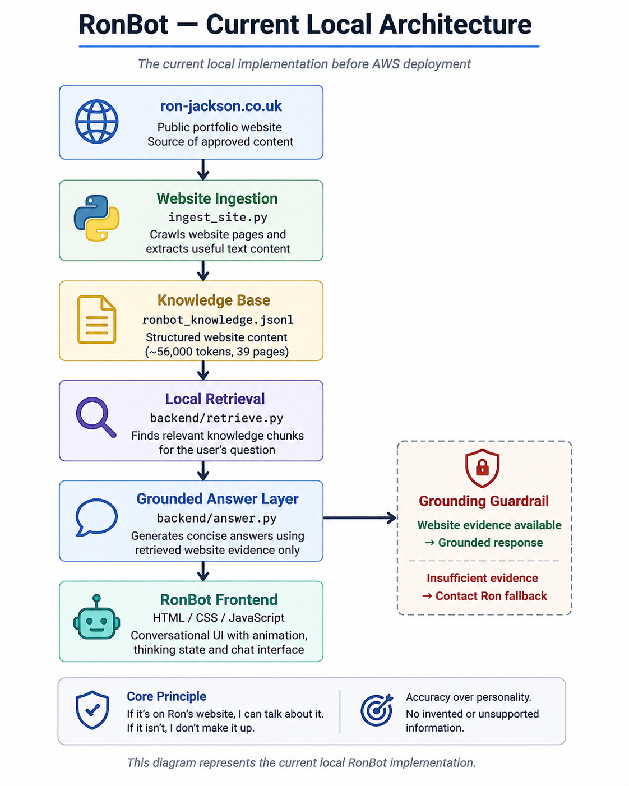

🤖 RonBot — Portfolio AI Assistant

RonBot is an AI-powered portfolio assistant for ron-jackson.co.uk, designed to help visitors explore Ron Jackson’s professional experience, skills, education, certifications and technical projects through natural conversation.

Unlike a general-purpose chatbot, RonBot is deliberately website-grounded. Answers must be supported by approved portfolio content. If the website does not contain enough information to answer accurately, RonBot does not guess.

  

If it’s on Ron’s website, I can talk about it. If it isn’t, I don’t make it up.

Project Overview

RonBot began as an idea for a more engaging alternative to a conventional website chatbot and is being developed incrementally into an AI-powered interface for the portfolio.

The project combines:

* A distinctive Robot Ron frontend experience
* Website content ingestion and knowledge preparation
* Local information retrieval
* Grounded answer generation
* Unknown-answer guardrails
* Conversational frontend interaction
* Planned AWS serverless deployment
* Planned RAG and semantic retrieval
* Longer-term evolution into a Portfolio AI Agent

The project is intentionally being built in stages so that retrieval quality, grounding and user experience can be validated before introducing production AI services.

Current Capabilities

The local RonBot prototype can currently:

* Crawl the public portfolio and build a structured knowledge source
* Search approximately 56,000 tokens of website-derived content
* Retrieve relevant portfolio information for natural-language questions
* Answer questions about experience, education, certifications, skills and selected personal information published on the website
* Combine evidence from multiple knowledge chunks when required
* Distinguish specific queries such as cloud certifications from broader certification questions
* Refuse to invent answers when the website does not contain sufficient evidence
* Direct unsupported questions to the Contact page
* Provide an animated conversational frontend
* Respect prefers-reduced-motion accessibility settings

A representative regression suite currently passes:

11 / 11 grounded-answer tests

Grounding Principle

Accuracy takes priority over personality.

RonBot is designed around a strict knowledge boundary:

Portfolio Website → RonBot Knowledge Base → Retrieval → Answer

External websites linked from the portfolio are not automatically treated as knowledge sources.

Questions that cannot be supported by retrieved website evidence result in a safe fallback rather than a fabricated answer.

This behaviour is fundamental to the project and will remain in place as RonBot moves toward production AI services.

Architecture

Current Local Architecture

Planned Local Architecture

The production architecture is designed around a low-cost, serverless AWS model.

See docs/architecture.md for the RON-02 architecture decision and technical rationale.

Technologies

Development: Python · HTML · CSS · JavaScript
AI / Retrieval: RAG · Information Retrieval · Grounded Q&A · Semantic Search (planned)
AWS: API Gateway · Lambda · Amazon Bedrock · Bedrock Knowledge Bases · Amazon S3
Engineering: Git · GitHub · JSONL · Web Content Ingestion

Robot Ron

RonBot deliberately avoids the appearance of a generic support chatbot.

RON-04 established a dedicated Robot Ron character as the visual identity of the assistant and as a recognisable part of the wider portfolio experience.

The production artwork is stored at:

frontend/assets/ronbot-production.png

See docs/ronbot-character.md for the full character specification.

Interaction Design

RON-05 and RON-06 established the local conversational interface.

The frontend currently includes:

* Robot Ron launcher
* Click-to-open and close behaviour
* Animated chat panel
* User and RonBot message bubbles
* Automatic conversation scrolling
* Purposeful thinking animation
* RonBot is thinking... state
* ARIA open/closed state
* Reduced-motion accessibility handling

An early continuous idle animation was intentionally removed after testing because it became distracting during conversation.

Motion is therefore used primarily as feedback rather than decoration.

Website Knowledge Pipeline

RON-07 introduced the ingestion process used to turn the public portfolio into a controlled local knowledge source.

The ingestion tooling:

1. Crawls same-site HTML pages from ron-jackson.co.uk
2. Extracts useful website text
3. Creates structured knowledge chunks
4. Preserves source information
5. Generates ronbot_knowledge.jsonl
6. Makes that content available to the retrieval layer

A successful ingestion run visited 39 pages and generated approximately 56,000 tokens of website-grounded content.

External destinations such as GitHub, LinkedIn and other linked websites remain outside the ingestion boundary.

Retrieval & Grounded Answers

RON-08 and RON-09 established the current local retrieval and answer baseline.

Development included:

* Website knowledge preparation
* Natural-language query matching
* Targeted query expansion
* Multi-chunk evidence handling
* Education and employment retrieval
* Certification retrieval
* Skills summaries
* Selected website-published personal information
* Unknown-answer detection
* Contact-page fallback
* Regression testing

Unsupported questions are deliberately included in testing.

For example, if the portfolio does not state Ron’s favourite food or the breed of his dogs, RonBot must not infer or invent an answer.

Regression Result

11 / 11 representative questions passed

This provides the stable local baseline from which the production API, AWS and AI integration can be developed.

Engineering Lessons

RON-07 and RON-08 also produced several useful troubleshooting lessons while establishing the local Python environment.

Issues investigated and resolved included:

* Python indentation and tab/space errors
* Website character encoding
* A broken .venv
* Python symlinks pointing to an unavailable installation
* Multiple local Python installations
* Homebrew Python repair
* Virtual environment recreation
* Dependency installation using python3 -m pip

These are retained as part of the engineering record because they demonstrate the diagnosis and resolution required to make the local ingestion and retrieval environment repeatable.

Project Progress

Task	Description	Status
RON-02	Define frontend, API, AI and website knowledge architecture	✅ Complete
RON-03	Define RonBot personality and response style	✅ Complete
RON-04	Create production RonBot character	✅ Complete
RON-05	Build local RonBot chat interface	✅ Complete
RON-06	Animation and interaction	✅ Complete
RON-07	Build website knowledge ingestion	✅ Complete
RON-08	Prepare and validate local knowledge retrieval	✅ Complete
RON-09	Grounded answers and unknown-answer fallback	✅ Complete

Further tasks cover frontend/API integration, AWS deployment, production AI integration, testing and the longer-term evolution of RonBot.

Roadmap

RonBot is being developed through two major stages:

RonBot v1 — Website-Grounded AI Assistant

Deliver a production-ready conversational assistant that allows visitors to explore the portfolio while remaining grounded in approved website content.

RonBot v2 — Portfolio AI Agent

Evolve RonBot beyond question-and-answer into a controlled portfolio agent capable of helping different visitors explore relevant information and navigate the portfolio intelligently.

Potential capabilities include:

* Recruiter / Hiring Manager / Engineer visitor experiences
* AI CV exploration
* Contextual project deep-dives
* Interactive architecture explanations
* Semantic portfolio search
* Controlled portfolio navigation and actions

The traditional portfolio remains available throughout; AI interaction is an optional way to explore it.

Repository Structure

RonBot-repo/
├── README.md
├── docs/
│   ├── architecture.md
│   ├── personality.md
│   └── ronbot-character.md
├── assets/
│   └── ronbot/
│       └── README.md
├── frontend/
│   ├── assets/
│   │   └── ronbot-production.png
│   ├── ronbot-widget.html
│   ├── ronbot.css
│   └── ronbot.js
├── backend/
│   ├── answer.py
│   └── retrieve.py
└── infrastructure/

The repository currently contains the local RonBot frontend, interaction layer, website ingestion process and retrieval/answer prototype.

The infrastructure/ directory is reserved for the later AWS deployment stages.

Project Philosophy

RonBot is not intended to demonstrate AI simply by adding a chatbot to a website.

The aim is to build a useful portfolio experience while gaining practical experience with retrieval, grounding, RAG, semantic search, serverless architecture, AI integration and responsible answer behaviour.

Each stage is being implemented, tested and documented before the next layer is introduced.
